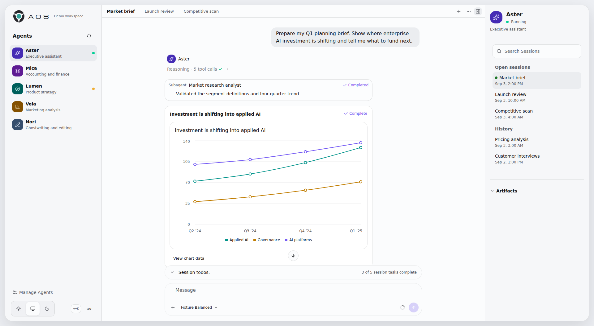

<div align="center">


# AOS UI

**A UI for personal agent harnesses serving real business use cases—and the companion to the [AOS kit](https://github.com/AlmogBaku/aos).**

[Get started](docs/getting-started.md) · [Choose a runtime](docs/runtime-capabilities.md) · [Deploy AOS](docs/deployment.md) · [Operator docs](docs/README.md)

<picture>
  <source media="(prefers-color-scheme: dark)" srcset="docs/assets/aos-workspace-dark.png">
  <source media="(prefers-color-scheme: light)" srcset="docs/assets/aos-workspace-light.png">
  
</picture>

</div>

Most agent harnesses present a coding-agent interface. AOS UI gives your personal harness a workspace for business use cases: an accountant, executive assistant, marketing agent, ghostwriter, product partner, hiring agent, or any other role you configure. It keeps their Agents and Sessions in one place without losing ownership, execution state, or pending work.

AOS UI complements the [AOS kit](https://github.com/AlmogBaku/aos), which packages installable capabilities for a separately operated agent harness. The browser uses the normalized AOS proxy; the selected native runtime keeps control of execution, credentials, Agent definitions, and durable history.

## What AOS provides

- Agent and Session navigation with provider-verified ownership
- Streaming chat, queued follow-ups, Stop, active-turn steering, questions,
  approvals, and attachments where the selected runtime supports them
- Session rename, archive, and delete with provider-owned read state (Hermes)
- Model and reasoning-effort selection with a context-window gauge where the
  runtime supports them
- Inline image, audio, and video Artifacts; conversation search; slash-command
  suggestions; questions answered from the composer with a free-text "Other";
  deep links to any Session
- Session-scoped Todos
- Safe, inspectable rich output including charts, maps, Mermaid, and published Artifacts
- Activity history and opt-in browser notifications
- English LTR and Hebrew RTL layouts with keyboard-first navigation
- Optional voice controls (microphone transcription and read-aloud) and restricted guest invitations

The browser has one real runtime: the normalized AOS proxy. The browser speaks
ACP v2 over a single WebSocket per tab to the proxy, and uses REST only for
bytes (attachments, Artifacts, audio) and discovery. Hermes is AOS's primary
and first-supported harness. The proxy can also attach to OpenClaw or OpenCode,
which is documented last as the newest attachment path. There is no
browser-direct provider mode.

## Quick start

AOS UI is not an agent harness. Run the AOS proxy against an authenticated harness separately.

### Prerequisites

- An independently operated Hermes, OpenClaw, or OpenCode runtime, plus that runtime's private credentials
- [Bun](https://bun.sh/)
- A current desktop browser

Install AOS UI:

```bash
git clone https://github.com/AlmogBaku/aos-ui.git
cd aos-ui
bun install
```

For local proxy development (the browser supports only `aos` and explicit
`fixture` mode):

```bash
# Terminal 1: use the private example for the selected runtime
bun run proxy:serve -- --config /absolute/private/path/proxy.yaml

# Terminal 2
AOS_UI_RUNTIME_MODE=aos \
AOS_UI_PROXY_TARGET=http://127.0.0.1:4100 \
  bun run dev
```

With no `--config`, the proxy discovers `${XDG_CONFIG_HOME:-$HOME/.config}/aos-ui/proxy.yaml`.

Open <http://localhost:3000>. The browser sends only normalized AOS requests;
the proxy owns provider credentials and all native communication. Configure
the private proxy copy to listen on `127.0.0.1:4100`, use
`http://localhost:3000` as its public origin, and point its runtime at the
selected native server. See [the runtime guides](docs/runtime-capabilities.md)
for the exact private configuration; runtime selection is server-side, not a
browser runtime mode.

### Preview without a harness

Fixture mode is an optional, backend-free preview of the interface. It is not a substitute for the AOS proxy:

```bash
AOS_UI_RUNTIME_MODE=fixture bun run dev
```

The fixture is deterministic and cannot create or modify native Agents. Continue with the [guided workspace tour](docs/getting-started.md).

## Deployment

AOS is served by the Bun proxy. Runtime selection comes from `/runtime-config.json`, so operators can switch between the proxy and explicit fixture mode without rebuilding the frontend.

For a containerized fixture preview:

```bash
cp .env.compose.example .env
AOS_UI_RUNTIME_CONFIG_FILE=./deploy/runtime-config.fixture.json \
  docker compose up --build
```

> [!IMPORTANT]
> Compose binds to loopback by default. The operator listener has no
> application login: anyone who can reach it can operate every visible Agent
> and Session. Expose it only on a trusted private network or behind your own
> TLS and access-control layer.

> [!NOTE]
> The default `{}` and the bare `.env.compose.example` value both fail the
> strict runtime-config schema. Every non-fixture recipe must set
> `AOS_UI_RUNTIME_CONFIG_FILE`. The readiness endpoint `/api/aos/v1/readyz`
> returns 503 until the runtime is reachable.

See [Deployment](docs/deployment.md) for native-runtime overlays, networking, health checks, and persistence.

## Documentation

| Goal                                      | Guide                                            |
| ----------------------------------------- | ------------------------------------------------ |
| Learn the workspace                       | [Getting started](docs/getting-started.md)       |
| Operate Agents and Sessions               | [Using AOS](docs/using-aos.md)                   |
| Configure a deployment                    | [Configuration reference](docs/configuration.md) |
| Resolve a problem                         | [Troubleshooting](docs/troubleshooting.md)       |
| Understand ownership and trust boundaries | [Architecture](docs/architecture.md)             |

The [operator documentation index](docs/README.md) lists every maintained guide.

## Verify a checkout

```bash
bun run test
bun run typecheck
bun run lint
bun run build
```

For UI, locale, runtime-composition, or browser-behavior changes:

```bash
bun run test:e2e
```

Additional checks are documented beside the runtime or deployment they cover.
