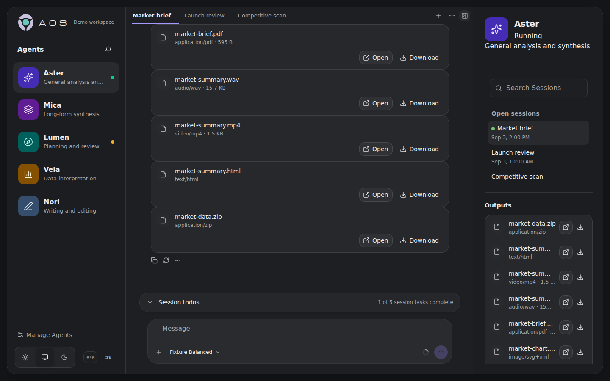

<div align="center">


# AOS UI

**A UI for personal agent harnesses serving real business use cases—and the companion to the [AOS kit](https://github.com/AlmogBaku/aos).**

[Get started](docs/getting-started.md) · [Choose a runtime](docs/runtime-capabilities.md) · [Deploy AOS](docs/deployment.md) · [Operator docs](docs/README.md)



</div>

Most agent harnesses present a coding-agent interface. AOS UI gives your personal harness a workspace for business use cases: an accountant, executive assistant, marketing agent, ghostwriter, product partner, hiring agent, or any other role you configure. It keeps their Agents and Sessions in one place without losing ownership, execution state, or pending work.

AOS UI complements the [AOS kit](https://github.com/AlmogBaku/aos), which packages installable capabilities for a separately operated agent harness. The browser uses the normalized AOS proxy; Hermes keeps control of execution, credentials, Agent definitions, and durable history.

## What AOS provides

- Agent and Session navigation with provider-verified ownership
- Streaming chat, queued messages, Stop, questions, approvals, and attachments where the selected runtime supports them
- Session-scoped Todos and message-scoped Plans
- Safe, inspectable rich output including charts, maps, Mermaid, and published Artifacts
- Activity history and opt-in browser notifications
- English LTR and Hebrew RTL layouts with keyboard-first navigation
- Optional Hermes voice controls and restricted guest invitations

The browser has one real runtime: the normalized AOS proxy. Future OpenCode and OpenClaw integrations remain server-side until they implement that proxy contract.

## Quick start

AOS UI is not an agent harness. Run the AOS proxy against an authenticated harness separately.

### Prerequisites

- The AOS proxy and an authenticated Hermes server
- [Bun](https://bun.sh/)
- A current desktop browser

Install AOS UI:

```bash
git clone https://github.com/AlmogBaku/aos-ui.git
cd aos-ui
bun install
```

For local proxy development:

```bash
AOS_UI_RUNTIME_MODE=aos \
AOS_UI_PROXY_TARGET=http://127.0.0.1:4100 \
  bun run dev
```

Open <http://localhost:3000>. The browser sends only normalized AOS requests;
the proxy owns Hermes authentication and all native communication. See [Run
AOS with Hermes](docs/runtimes/hermes.md) for private proxy configuration.

### Preview without a harness

Fixture mode is an optional, backend-free preview of the interface. It is not a substitute for the AOS proxy:

```bash
AOS_UI_RUNTIME_MODE=fixture bun run dev
```

The fixture is deterministic and cannot create or modify native Agents. Continue with the [guided workspace tour](docs/getting-started.md).

## Deployment

AOS is served by the Bun proxy. Runtime selection comes from `/runtime-config.json`, so operators can switch between the proxy and explicit fixture mode without rebuilding the frontend.

For a containerized fixture preview:

```bash
cp .env.compose.example .env
AOS_UI_RUNTIME_CONFIG_FILE=./deploy/runtime-config.fixture.json \
  docker compose up --build
```

> [!IMPORTANT]
> Compose binds to loopback by default. AOS does not provide TLS or public multi-user authentication. Expose it more widely only behind controls appropriate for a trusted private network.

See [Deployment](docs/deployment.md) for native-runtime overlays, networking, health checks, and persistence.

## Documentation

| Goal                                      | Guide                                            |
| ----------------------------------------- | ------------------------------------------------ |
| Learn the workspace                       | [Getting started](docs/getting-started.md)       |
| Operate Agents and Sessions               | [Using AOS](docs/using-aos.md)                   |
| Configure a deployment                    | [Configuration reference](docs/configuration.md) |
| Resolve a problem                         | [Troubleshooting](docs/troubleshooting.md)       |
| Understand ownership and trust boundaries | [Architecture](docs/architecture.md)             |

The [operator documentation index](docs/README.md) lists every maintained guide.

## Verify a checkout

```bash
bun run test
bun run typecheck
bun run lint
bun run build
```

Additional checks are documented beside the runtime or deployment they cover.
