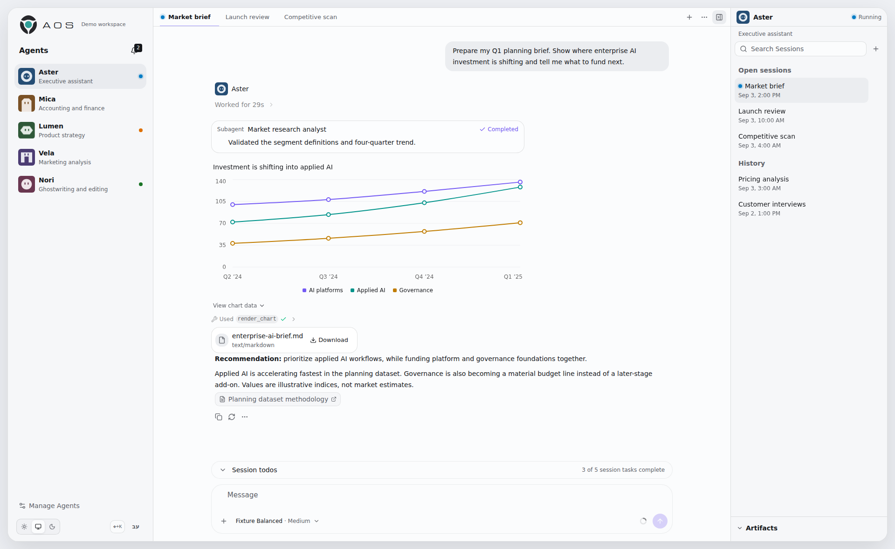

<div align="center">


# AOS UI

**A UI for personal agent harnesses serving real business use cases—and the companion to the [AOS kit](https://github.com/AlmogBaku/aos).**

[Get started](docs/getting-started.md) · [Choose a runtime](docs/runtime-capabilities.md) · [Deploy AOS](docs/deployment.md) · [Operator docs](docs/README.md)

<picture>
  <source media="(prefers-color-scheme: dark)" srcset="docs/assets/aos-workspace-dark.png">
  <source media="(prefers-color-scheme: light)" srcset="docs/assets/aos-workspace-light.png">
  
</picture>

</div>

Most agent harnesses present a coding-agent interface. AOS UI gives your personal harness a workspace for business use cases: an accountant, executive assistant, marketing agent, ghostwriter, product partner, hiring agent, or any other role you configure. It keeps their Agents and Sessions in one place without losing ownership, execution state, or pending work.

AOS UI complements the [AOS kit](https://github.com/AlmogBaku/aos), which packages installable capabilities for a separately operated agent harness. The browser talks to the [harness-gw](https://github.com/AlmogBaku/harness-gw) gateway; the selected native runtime keeps control of execution, credentials, Agent definitions, and durable history.

## What AOS provides

- Agent and Session navigation with provider-verified ownership, Session tabs,
  and pinned Sessions that always stay open
- Streaming chat, Stop, active-turn steering, questions, approvals, and
  attachments where the selected runtime supports them
- A message queue docked to the composer: reorder queued follow-ups, pull them
  back into the composer to edit, or send the whole queue as one message
- Session rename, pin, archive, and delete with provider-owned read state
- Model and reasoning-effort selection with a context-window gauge where the
  runtime supports them
- Runtime notices in the thread (for example Hermes goals, loops, heartbeats,
  and background processes), a reconnecting notice while the connection
  recovers, and the platform each Session came from
- Inline image, audio, and video Artifacts; conversation search; slash-command
  suggestions; questions answered from the composer with a free-text "Other";
  deep links to any Session
- Session-scoped Todos
- Safe, inspectable rich output including charts, maps, Mermaid, published
  Artifacts, and sandboxed MCP Apps
- A stateless tools MCP server (`bun run tools-mcp:serve`) that gives any
  harness the `render_chart`, `render_map`, and `render_stats` MCP Apps and
  `present_artifact`, which shows a file in a live card with PDF rendering,
  image preview, text view, and sandboxed HTML — with pip, download, and refresh
- Agent icons and visibility management, and `New Agent` creation through a
  runtime's hidden creator where one is configured
- Activity history, opt-in browser notifications, optional Web Push, and an
  installable app window
- English LTR and Hebrew RTL layouts with keyboard-first navigation and a
  command palette
- Optional voice controls (microphone transcription and read-aloud) and restricted guest invitations

The browser has one real runtime: the harness-gw gateway, a separate project
that puts one native runtime behind ACP v2. Through the gateway's published
browser client, [`@harness-gw/sdk`](https://www.npmjs.com/package/@harness-gw/sdk),
the browser speaks ACP over a single WebSocket per tab, and uses its `/api/v1` HTTP API only
for bytes (attachments, Artifacts, audio) and discovery. Hermes is AOS's
primary and first-supported harness. The gateway can also attach to OpenClaw
or OpenCode, which is documented last as the newest attachment path. There is
no browser-direct provider mode.

## Quick start

AOS UI is not an agent harness, and it does not include the gateway. Run the
harness-gw gateway against an authenticated harness separately.

### Prerequisites

- An independently operated Hermes, OpenClaw, or OpenCode runtime, plus that runtime's private credentials
- [Bun](https://bun.sh/)
- [Docker](https://docs.docker.com/get-docker/), to run the published
  [harness-gw](https://github.com/AlmogBaku/harness-gw) image for anything
  beyond the fixture preview
- A current desktop browser

Install AOS UI:

```bash
git clone https://github.com/AlmogBaku/aos-ui.git
cd aos-ui
bun install
```

For local development against a real runtime (the browser supports only `aos`
and explicit `fixture` mode):

```bash
# Terminal 1: the gateway, from a private copy of its example config for the
# selected runtime (examples/config.<runtime>.example.yaml in harness-gw)
docker run --rm -p 127.0.0.1:4100:4100 \
  -v /absolute/private/path/config.yaml:/run/harness-gw/config.yaml:ro \
  -v /absolute/private/path/hermes-token:/run/secrets/hermes-token:ro \
  ghcr.io/almogbaku/harness-gw:0.1.2 \
  serve --config /run/harness-gw/config.yaml

# Terminal 2, in this checkout
AOS_UI_RUNTIME_MODE=aos \
AOS_UI_GATEWAY_TARGET=http://127.0.0.1:4100 \
  bun run dev
```

Open <http://localhost:3000>. Vite forwards only `/api/v1` to the gateway,
which owns provider credentials and all native communication. In the private
gateway config, use `http://localhost:3000` as the public origin and point the
runtime at the selected native server. Run `config check` in place of `serve`
first to validate the file and every secret file it names. See [the runtime guides](docs/runtime-capabilities.md)
and the harness-gw [README](https://github.com/AlmogBaku/harness-gw#readme);
runtime selection is server-side, not a browser runtime mode.

### Preview without a harness

Fixture mode is an optional, backend-free preview of the interface. It is not a substitute for the gateway:

```bash
AOS_UI_RUNTIME_MODE=fixture bun run dev
```

The fixture is deterministic and cannot create or modify native Agents. Continue with the [guided workspace tour](docs/getting-started.md).

## Deployment

Compose runs three pieces behind one origin per lane: Caddy, the only
published port; the aos-ui web server (`bun run web:serve`), which serves the
built app and `/runtime-config.json`; and, under a harness overlay, the
harness-gw gateway, which answers `/api/v1`. Each harness overlay pulls the
gateway image pinned by digest; set `HARNESS_GW_IMAGE` to run another build.
Runtime selection comes from
`/runtime-config.json`, so operators can switch between the gateway and
explicit fixture mode without rebuilding the frontend.

For a containerized fixture preview:

```bash
cp .env.compose.example .env
AOS_UI_RUNTIME_CONFIG_FILE=./deploy/runtime-config.fixture.json \
  docker compose up --build
```

> [!IMPORTANT]
> Compose binds to loopback by default. The operator listener has no
> application login: anyone who can reach it can operate every visible Agent
> and Session. Expose it only on a trusted private network or behind your own
> TLS and access-control layer.

> [!NOTE]
> The default `{}` fails the strict runtime-config schema, and the copied
> `.env.compose.example` selects the fixture file. Every non-fixture recipe
> must set `AOS_UI_RUNTIME_CONFIG_FILE`. Under a harness overlay, the
> gateway's readiness endpoint `/api/v1/readyz` returns 503 until the runtime
> is reachable.

Every Compose file set also starts the `tools-mcp` service on `127.0.0.1:4110`
(`AOS_UI_TOOLS_MCP_PORT`); register `http://127.0.0.1:4110/mcp` with your
harness as described in its runtime guide.

On a host that runs the stack with host networking, add
`deploy/compose.host.yaml` after the harness overlay. See
[Deployment](docs/deployment.md) for native-runtime overlays, networking,
health checks, and persistence.

## Documentation

| Goal                                      | Guide                                            |
| ----------------------------------------- | ------------------------------------------------ |
| Learn the workspace                       | [Getting started](docs/getting-started.md)       |
| Operate Agents and Sessions               | [Using AOS](docs/using-aos.md)                   |
| Configure a deployment                    | [Configuration reference](docs/configuration.md) |
| Resolve a problem                         | [Troubleshooting](docs/troubleshooting.md)       |
| Understand ownership and trust boundaries | [Architecture](docs/architecture.md)             |

The [operator documentation index](docs/README.md) lists every maintained guide.

## Verify a checkout

```bash
bun run test
bun run test:gate
bun run typecheck
bun run lint
bun run build
```

For UI, locale, runtime-composition, or browser-behavior changes:

```bash
bun run test:e2e
```

Additional checks are documented beside the runtime or deployment they cover.
